# starrocks-connector-for-kettle

# Why

目前，StarRocks兼容并支持DataX、Flink以及Spark这三种高效的数据处理框架，从而实现数据的有效写入到StarRocks中。然而，需要注意的是，这三种框架的操作均基于命令行或代码，这可能对非技术人员构成一定的挑战。因此，为了增加易用性并优化用户体验，我们正在扩展StarRocks的Kettle Connector，以实现直观的、可视化的数据导入操作，使得无论技术背景如何，用户都能够方便快捷地进行数据导入。

Kettle是一个流行的ETL工具，它提供了一种可视化的图形界面，用户可以通过拖拽组件、配置参数等方式来构建数据处理流程。这种直观的操作方式大大简化了数据处理和导入的过程，使得用户可以更加便捷地处理数据。此外，Kettle还提供了丰富的操作组件库，用户可以根据自己的需求选择合适的组件，实现各种复杂的数据处理任务。

通过扩展StarRocks对Kettle的连接功能，用户不仅可以实现更方便的数据导入，还可以利用Kettle的操作组件库，提供更便捷、更灵活的数据处理和导入方式。用户可以更加方便地从各种数据源读取数据，然后通过Kettle的数据处理流程，将处理后的数据导入到StarRocks。

# What

StarRocks Kettle Connector实现了Kettle的一个插件，它用于在StarRocks和Kettle之间建立连接，以实现众多数据源数据向StarRocks导入和ETL（Extract, Transform, Load）功能。通过此插件，可以将Kettle的强大数据处理和转换功能与StarRocks的高性能数据存储和分析能力相结合，从而实现更加灵活和高效的数据处理流程。

使用StarRocks Kettle Connector的场景包括：

1. 数据集成：当需要从不同的数据源中抽取数据，进行数据清洗和转换，最后将数据加载到StarRocks中进行分析和查询时，可以使用此功能来实现数据集成和ETL。
2. 复杂数据处理：当数据处理流程比较复杂，需要多个数据转换步骤和数据源连接时，可以利用Kettle的可视化界面来设计和配置ETL工作流程，最后将数据记载到StarRocks，提高开发效率和灵活性。
3. 数据转换和整合：当需要对原始数据进行复杂的转换和整合，以满足特定的数据分析和查询需求时，可以使用Kettle的强大数据转换功能来实现。

通过StarRocks Kettle Connector，用户可以获得以下好处：

1. 便捷性：利用Kettle的可视化界面，可以以图形化方式设计和配置复杂的ETL工作流程，简化了从不同数据源向StarRocks的数据加载过程，降低学习成本。
2. 灵活性：通过与Kettle的连接，扩展了StarRocks的数据处理能力，使得用户可以根据自己的需求选择适合的工具和方式来进行数据处理。
3. 高性能：StarRocks作为一个高性能的数据存储和分析引擎，与Kettle的连接可以将高效的数据加载与复杂的数据转换和整合相结合，从而提高数据处理的性能。

# How

## Kettle安装

如果已经装有Kettle可跳过此步骤。

首先，需要从Github上下载对应版本的[Kettle源码](https://github.com/pentaho/pentaho-kettle)，并根据Readme构建Kettle项目。Kettle项目使用的是Maven框架，需要如下准备：

- Maven,version3+
- Java JDK 11
- 使用该[settings.xml](https://raw.githubusercontent.com/pentaho/maven-parent-poms/master/maven-support-files/settings.xml) 在/.m2 文件夹

最后生成Kettle应用压缩包：<源码目录>\assemblies\pdi-ce\target\pdi-ce-x.x.x.x-xxx.zip

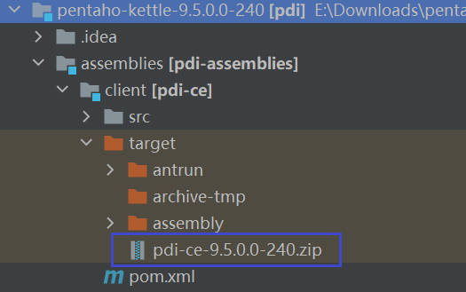

直接可以在[Kettle官网](https://www.hitachivantara.com/en-us/products/pentaho-platform/data-integration-analytics/pentaho-community-edition.html)下载，点击`Download Now`在下列菜单中即可找到`pdi-ce-x.x.x.x-xxx.zip`压缩包下载。

## Kettle启动

解压上一步得到的pdi-ce-x.x.x.x-xxx.zip压缩包，得到Kettle应用data-integration无需安装。data-integration文件包含如下启动文件：

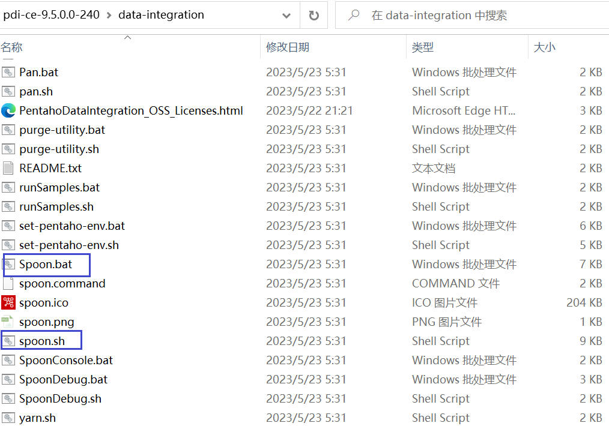

通过Spoon.bat(Windows)或Spoon.sh(Linux)启动Kettle图形界面，如下显示证明启动成功。


## 导入StarRocks Kettle Connector 插件

- 下载StarRocks Kettle Connector的插件源码，将其进行打包编译得到**assemblies/plugin/target/StarRocks-Kettle-Connector-plugin-x.x.x.x-xxx.zip**包。
- 将**StarRocks-Kettle-Connector-plugin-x.x.x.x-xxx.zip**包放在**data-integration\plugins**文件目录下。
- 将插件包直接解压到当前文件夹，生成**StarRocks-Kettle-Connector**文件包。
- 启动Spoon，**转换/批量**加载中即可看到**StarRocks Kettle Connector**插件。

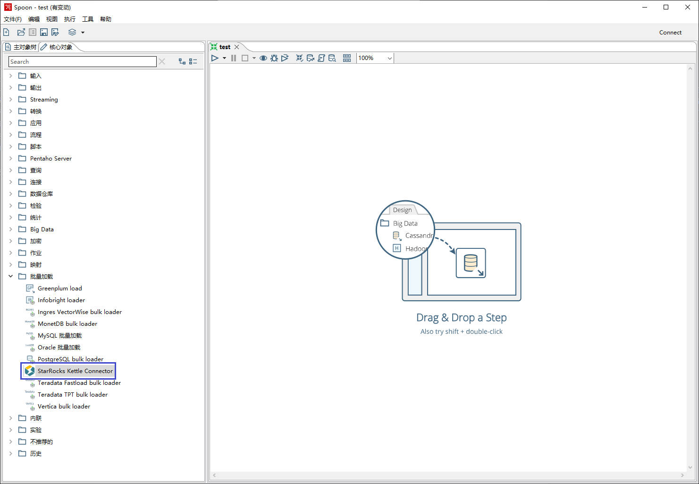

拖拽或者双击将StarRocks Kettle Connector插件生成新的step，之后再双击右侧新添加的StarRocks Kettle Connector插件step即可配置数据导入参数。

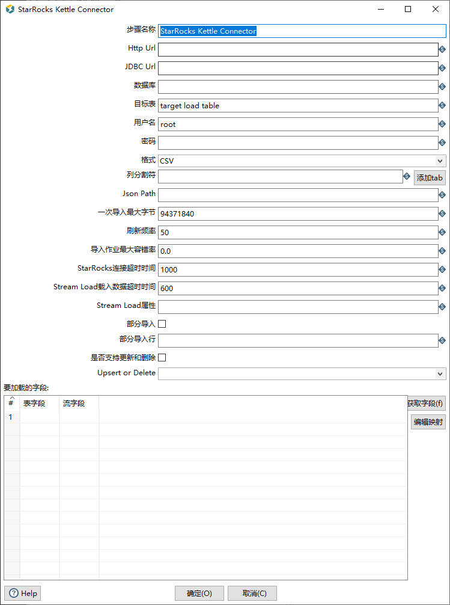

## 参数说明

| 参数                                            | 是否必填 | 默认值                     | 数据类型 | 描述                                                         |
| :---------------------------------------------- | -------- | -------------------------- | -------- | ------------------------------------------------------------ |
| 步骤名称-Step name                              | 是       | StarRocks Kettle Connector | String   | 该步骤名称                                                   |
| Http Url                                        | 是       | 无                         | String   | FE 的 HTTP Server 连接地址。格式为 `<fe_host1>:<fe_http_port1>;<fe_host2>:<fe_http_port2>`，可以提供多个地址，使用英文分号 (;) 分隔。例如 `192.168.xxx.xxx:8030;192.168.xxx.xxx:8030`。 |
| JDBC Url                                        | 是       | 无                         | String   | FE 的 MySQL Server 连接地址。格式为 `jdbc:mysql://<fe_host>:<fe_query_port>`。 |
| 数据库-DataBase Name                            | 是       | 无                         | String   | StarRocks 目标数据库的名称。                                 |
| 目标表-Table Name                               | 是       | 无                         | String   | StarRocks 目标数据表的名称。                                 |
| 用户名-User                                     | 是       | 无                         | String   | 用于访问 StarRocks 集群的用户名。该账号需具备 StarRocks 目标数据表的写权限。有关用户权限的说明，请参见[用户权限](https://docs.starrocks.io/zh-cn/latest/administration/User_privilege)。 |
| 密码-Password                                   | 否       | 无                         | String   | 用于访问 StarRocks 集群的用户密码。若没有密码则不用填写。    |
| 格式-Format                                     | 是       | CSV                        | String   | Stream Load 导入时的数据格式。取值为 `CSV` 或者 `JSON`。     |
| 列分割符-Column Sepatator                       | 否       | \t                         | String   | 用于指定源数据文件中的列分隔符。如果不指定该参数，则默认为 `\t`，即 Tab。必须确保这里指定的列分隔符与源数据文件中的列分隔符一致。该参数当选择CSV格式的时候必须填写。<br />**说明**<br />StarRocks 支持设置长度最大不超过 50 个字节的 UTF-8 编码字符串作为列分隔符，包括常见的逗号 `,`、`Tab` 和 `Pipe ()` |
| Json Paths                                      | 否       | 无                         | String   | 用于指定待导入的字段的名称。仅在使用匹配模式导入 JSON 数据时需要指定该参数。当格式选择JSON时填写该参数。参见[导入 JSON 数据时配置列映射关系](https://docs.starrocks.io/zh-cn/latest/sql-reference/sql-statements/data-manipulation/STREAM%20LOAD#导入-json-数据时配置列映射关系). |
| 一次导入最大字节-Max Bytes                      | 否       | 94371840(90M)              | String   | 数据攒批的大小，达到该阈值后将数据通过 Stream Load 批量写入 StarRocks。取值范围：[64MB, 10GB]。 |
| 刷新频率-Scanning Frequency                     | 否       | 50                         | String   | 数据刷新的时间，每隔多长时间进行一次数据刷新写入。参数单位为毫秒，取值大于等于50毫秒。 |
| 导入作业最大容错率-Max Filter Ratio             | 否       | 0                          | String   | 用于指定导入作业的最大容错率，即导入作业能够容忍的因数据质量不合格而过滤掉的数据行所占的最大比例。取值范围：0~1。默认值：0。更多说明，请参见 [STREAM LOAD](https://docs.starrocks.io/zh-cn/latest/sql-reference/sql-statements/data-manipulation/STREAM%20LOAD#opt_properties)。 |
| StarRocks连接超时时间-Connect Timeout           | 否       | 1000                       | String   | 连接 `Http-url` 的超时时间。取值范围：[100, 60000]。         |
| Stream Load载入数据超时时间-Stream Load Timeout | 否       | 600                        | String   | Stream Load 超时时间，单位为秒。                             |
| Stream Load 属性-Stream Load Properties         | 否       | 无                         | String   | Stream Load 的参数，控制导入行为，支持的参数和说明，请参见 [STREAM LOAD](https://docs.starrocks.io/zh-cn/latest/sql-reference/sql-statements/data-manipulation/STREAM%20LOAD)。<br />参数的名称和值需要用`:`隔开，各参数之间用`;`隔开。例如：`key1:value1;key2:value2` |
| 部分导入-Partial Update                         | 否       | 否                         |          | StarRocks v2.2 起，主键模型表支持部分更新，可以选择只更新部分指定的列。若勾选实现部分导入需要在“部分导入行”中填写要导入的列名。 |
| 部分导入行-Partial Update Columns               | 否       | 无                         | String   | 需要部分更新的列名。需要填写所要写入的目标表中对应的列名。各列名之间要以英文逗号隔开`,`，例如：`col1,col2,col3` |
| 是否支持更新和删除-Enable Upsert Delete         | 否       | 无                         |          | StarRocks 目前支持 `UPSERT` 和 `DELETE `操作，不支持一次作业区分`UPSERT`和`DELETE`，只能对一次导入单独实现`UPSERT`和`DELETE`。<br />  **UPSERT**: 该操作用于插入或更新数据。如果数据已存在（基于主键/唯一键），它将更新该数据；如果数据不存在，它将插入新数据。<br /> **DELETE**: 该操作用于删除符合条件的数据记录。需要指定删除的条件，满足该条件的所有记录都将被删除。 |
| Upsert or Delete                                | 否       | 无                         | String   | 当勾选“是否支持更新和删除”时需要选择是执行UPSERT或DELETE操作。若未选择则不执行更新或删除操作。 |
| 表字段-Table field                              | 否       | 无                         | String   | StarRocks目标表中各列的名称。需要与流字段一一对应。          |
| 流字段-Stream field                             | 否       | 无                         | String   | 上一步骤传输过来的数据列名称。从上一步骤传递的数据列名称和类型必须与StarRocks目标表的数据格式和大小完全匹配。 |


## StarRocks-Kettle数据类型对应关系

### Kettle数据类型

1. **String**：存储字符串或文本信息。
2. **Date**：存储日期信息。日期被存储为从1970-01-01 00:00:00.000 GMT开始的毫秒数。因此，可以保存任何日期和时间，从公元前至公元后。日期类型的默认掩码为yyyy/MM/dd HH:mm:ss.SSS。
3. **Boolean**：存储逻辑值，即True/False。
4. **Integer**：存储整数值。所有整数都被当作长整型(Long)处理，范围在-9223372036854775808到9223372036854775807之间。
5. **Number**：用于存储浮点数。这是一种双精度浮点类型，具有至少15位的精度。
6. **BigNumber**：用于存储任意精度的数字，适合用于精确的科学计算。
7. **Binary**：用于存储二进制对象。
8. **Timestamp**：这是一个扩展数据库的日期类型，允许更好地在数据库中处理日期和时间的组合。
9. **Internet Address**：存储Internet地址，主要存储网站的IPV4或IPV6地址。

### StarRocks数据类型以及与Kettle对应

| Kettle           | StarRocks                                                    |
| ---------------- | ------------------------------------------------------------ |
| String           | CHAR、STRING、VARCHAR、JSON                                  |
| Date             | DATE、DATETIME                                               |
| Boolean          | BOOLEAN                                                      |
| Integer          | TINYINT 、SMALLINT 、INT 、BIGINT                            |
| Number           | DOUBLE、FLOAT                                                |
| BigNumber        | LARGEINT、[DECIMAL](https://docs.starrocks.io/zh-cn/latest/sql-reference/sql-statements/data-types/DECIMAL) |
| Binary           | 暂不支持                                                     |
| Timestamp        | DATETIME、DATE                                               |
| Internet Address | STRING                                                       |
| serializable     | 暂不支持                                                     |


## 使用示例

本节介绍如何使用StarRocks-Kettle Connector插件从本地文件系统导入CSV或JSON格式的数据。

### 导入CSV格式的数据

#### 准备工作

1. 在本地文件系统中创建一个 CSV 格式的数据文件 `example1.csv`。文件一共包含三列，分别代表用户 ID、用户姓名和用户得分，如下所示：

```Plain
1,Lily,23
2,Rose,23
3,Alice,24
4,Julia,25
```

2. 在数据库 `kettle_test` 中创建一张名为 `student` 的主键模型表。表包含 `id`、`name` 和 `score` 三列，主键为 `id` 列，如下所示：

~~~mysql
CREATE TABLE `student`
(
    `id` int(11) NOT NULL COMMENT "用户 ID",
    `name` varchar(65533) NULL COMMENT "用户姓名",
    `score` int(11) NOT NULL COMMENT "用户得分"
)
ENGINE=OLAP
PRIMARY KEY(`id`)
DISTRIBUTED BY HASH(`id`);
~~~


#### 使用Kettle读取csv文件数据

1. 填写文件信息，并将列分割符改成`,`与CSV文件中一样。当CSV文件中没有列头行时取消列头行的勾选。

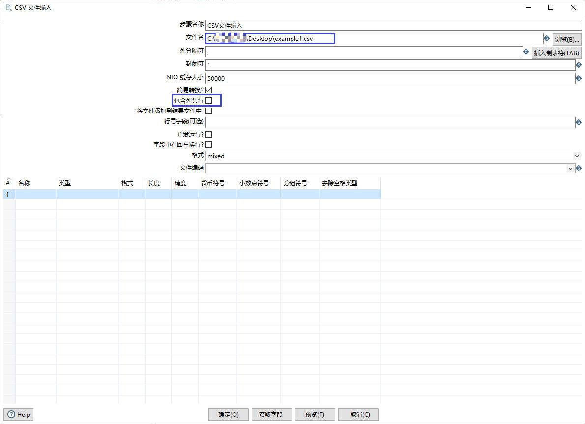

2. 获取字段信息

> 点击**获取字段**，得到CSV中的字段信息和类型。
>
> 若CSV文件中没有包含头行信息，则**名称**列将会显示`Field_xxx`，为了后续步骤区分字段名称可以自行命名。
>
> 字段类型Kettle会自动识别，如果需要更改可直接下拉菜单更改类型。

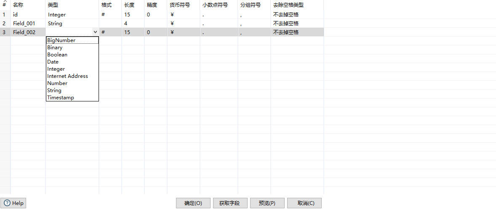

3. 数据预览

当配置完信息后，可点击最后的**预览**按钮预览需要导入的数据。

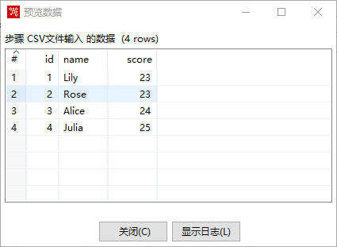

#### 向StarRocks中导入数据

1. 添加StarRocks Kettle Connector插件，将**CSV文件输入**步骤输出的数据导入**StarRocks Kettle Connector**。

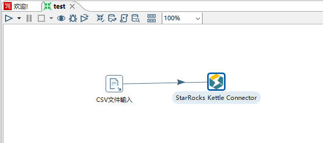

2. 如下图所示配置StarRocks Kettle Connector插件参数。

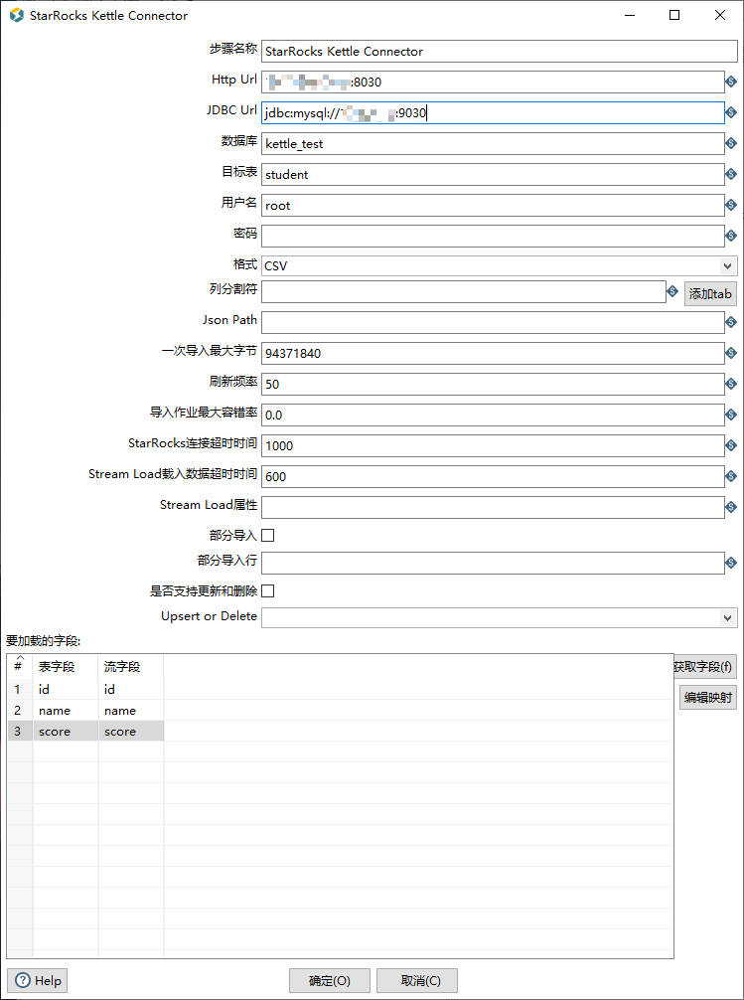

> **说明**
>
> 您可以通过 [SHOW FRONTENDS](https://docs.starrocks.io/zh-cn/latest/sql-reference/sql-statements/Administration/SHOW%20FRONTENDS) 命令查看 FE 节点的 IP 地址和 HTTP 端口号。

此处**列分割符**与上一步**CSV文件输入**中的分隔符并无关联可随意指定。当连接StarRocks时不需**密码**时填写为空即可。

最下面表格中，**表字段**为目标StarRocks数据库表字段，**流字段**为上一步骤中传来的字段名称。若两者对应关系出现错误，需要更改**表字段**使其与流字段对应，不要改变流字段的顺序。可以直接在表字段名称上下拉菜单更改，也可点击右侧**编辑映射**。

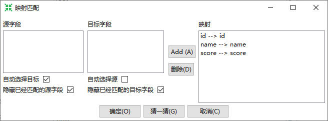

3. 点击开始按钮执行导入作业

点击左上的开始按钮则开始转换，转换成功如下图所示。

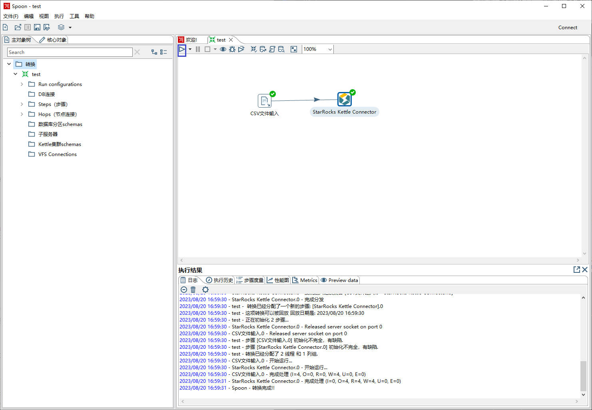

4. 查询导入结果

```SQL
StarRocks > select * from student;
+------+-------+-------+
| id   | name  | score |
+------+-------+-------+
|    3 | Alice |    24 |
|    1 | Lily  |    23 |
|    2 | Rose  |    23 |
|    4 | Julia |    25 |
+------+-------+-------+
4 rows in set (0.01 sec)
```

### 导入JSON格式的数据

#### 数据准备

1. 在本地文件系统中创建一个 JSON 格式的数据文件 `example2.json`。文件一共包含两个字段，分别代表城市名称和城市 ID，如下所示：

~~~json
{"name": "北京", "id": 1}
~~~

2. 在数据库 `kettle_test` 中创建一张名为 `city` 的主键模型表。表包含 `id` 和 `city` 两列，主键为 `id` 列，如下所示：

~~~mysql
CREATE TABLE `city`
(
    `id` int(11) NOT NULL COMMENT "城市 ID",
     `city` varchar(65533) NULL COMMENT "城市名称"
)
ENGINE=OLAP
PRIMARY KEY(`id`)
DISTRIBUTED BY HASH(`id`);
~~~


#### 使用Kettle读取JSON文件数据

1. 在Kettle中添加**JSON Input**插件，并配置信息。

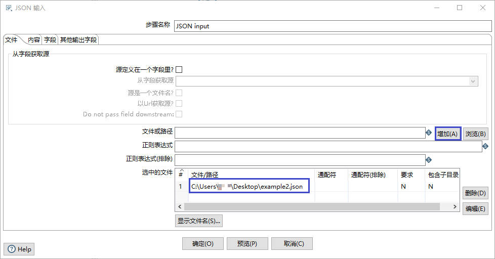

在**文件或路径**中添加`example2.json`文件路径，点击添加即可在选中的文件中看到**文件或路径**中填写的路径。

在**字段**中选择`Select fields`，并选择要导入的字段信息。与**CSV**相同要根据具体的数据与StarRocks库中的数据类型相对应更改**类型字段**。

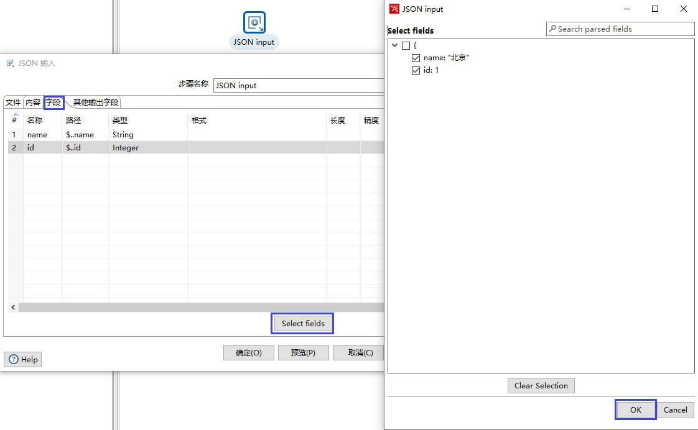


#### 向StarRocks中导入数据

1. 配置StarRocks参数

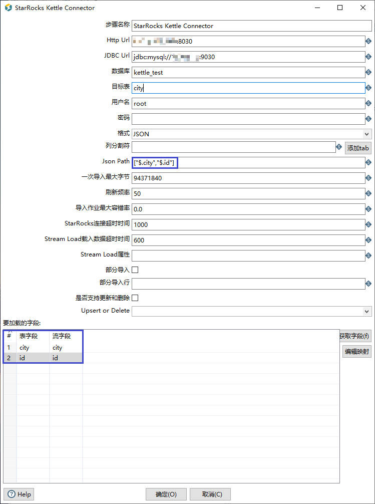

> 目前暂不支持列计算

其余配置与**CSV**基本相同，需要更改**格式**与**Json Path**参数。其中Json Path顺序需要和表字段相同或不填写。

2. 启动任务查询结果

~~~mysql
StarRocks > select * from city;
+------+--------+
| id   | city   |
+------+--------+
|    1 | 北京   |
+------+--------+
1 row in set (0.00 sec)
~~~


### 通过导入实现数据变更

StarRocks 还支持部分更新 (Partial Update) 和条件更新 (Conditional Update)。


#### 数据变更

> 目前**StarRocks Kettle Connector**目前支持**UPSERT**和**DELETE**操作，仅支持在一个步骤中使用一种操，不支持一个步骤中同时实现**UPSERT**和**DELETE**。在Kettle上游传输过来的数据中没有区分对每条数据进行那种操作的标识，因此不能对一批数据进行分别使用**UPSERT**或**DELETE**。若想要进行区分处理，可以尝试使用Kettle步骤开启复制多线程将数据分开两条数据流分别对其进行数据过滤最后通过UPSERT或DELETE将数据导入。

##### 使用说明

- 必须确保待导入的数据文件中每一行的列数都相同。
- 所更新的列必须包含主键列。

##### UPSERT

1. 准备数据文件

在本地文件系统创建一个 CSV 格式的数据文件 `example1.csv`。文件包含三列，分别代表用户 ID、用户姓名和用户得分，如下所示：

~~~mysql
1,Lily,90
5,Jeson,0
~~~

2. 准备 StarRocks 表。

在数据库 `kettle_test` 中创建一张名为 `table1` 的主键模型表。表包含 `id`、`name` 和 `score` 三列，分别代表用户 ID、用户名称和用户得分，主键为 `id` 列，如下所示：

~~~mysql
CREATE TABLE `student`
(
    `id` int(11) NOT NULL COMMENT "用户 ID",
    `name` varchar(65533) NOT NULL COMMENT "用户姓名",
    `score` int(11) NOT NULL COMMENT "用户得分"
)
ENGINE=OLAP
PRIMARY KEY(`id`)
DISTRIBUTED BY HASH(`id`);
~~~

向数据库中插入数据：

~~~mysql
StarRocks > select * from student;
+------+-------+-------+
| id   | name  | score |
+------+-------+-------+
|    1 | Lily  |    23 |
|    2 | Rose  |    23 |
|    4 | Julia |    25 |
|    3 | Alice |    24 |
+------+-------+-------+
4 rows in set (0.01 sec)
~~~

3. UPSERT数据

通过导入，把 `example1.csv` 文件中 `id` 为 `1` 的数据更新到 `student` 表中，并且把 `example1.csv` 文件中 `id` 为 `5` 的数据插入到 `student` 表中。

配置信息如下图所示，首先要勾选**是否支持更新和删除**并在`Upsert or Delete`选中UPSERT。

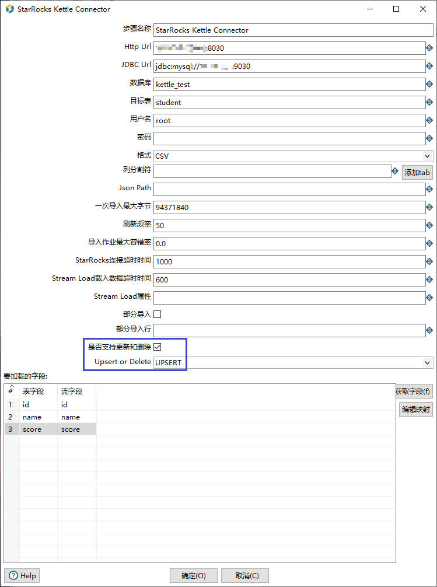

4. 运行并查询数据

导入完成后，查询`student`表的数据，如下所示：

~~~mysql
StarRocks > select * from student;
+------+-------+-------+
| id   | name  | score |
+------+-------+-------+
|    3 | Alice |    24 |
|    2 | Rose  |    23 |
|    4 | Julia |    25 |
|    1 | Lily  |    90 |
|    5 | Jeson |     0 |
+------+-------+-------+
5 rows in set (0.00 sec)
~~~

从查询结果可以看到，`exaple1.csv`文件中`id`为`1`的数据已经更新`score`值，`id`为`5`的数据被插入到数据库。


##### DELETE

1. 准备数据文件

在本地文件系统创建一个 CSV 格式的数据文件 `example2.csv`。文件包含三列，分别代表用户 ID、用户姓名和用户得分，如下所示：

~~~mysql
2,Rose,23
~~~

2. 准备StarRocks表

使用上一步创建的数据库 `kettle_test` 中名为 `student` 的主键模型表。表包含 `id`、`name` 和 `score` 三列，分别代表用户 ID、用户名称和用户得分，主键为 `id` 列，其中数据如下所示：

~~~mysql
StarRocks > select * from student;
+------+-------+-------+
| id   | name  | score |
+------+-------+-------+
|    3 | Alice |    24 |
|    2 | Rose  |    23 |
|    4 | Julia |    25 |
|    1 | Lily  |    90 |
|    5 | Jeson |     0 |
+------+-------+-------+
5 rows in set (0.00 sec)
~~~

3. 导入数据

通过导入，把 `example2.csv` 文件中 `id` 为 `2` 的数据从 `student` 表中删除。

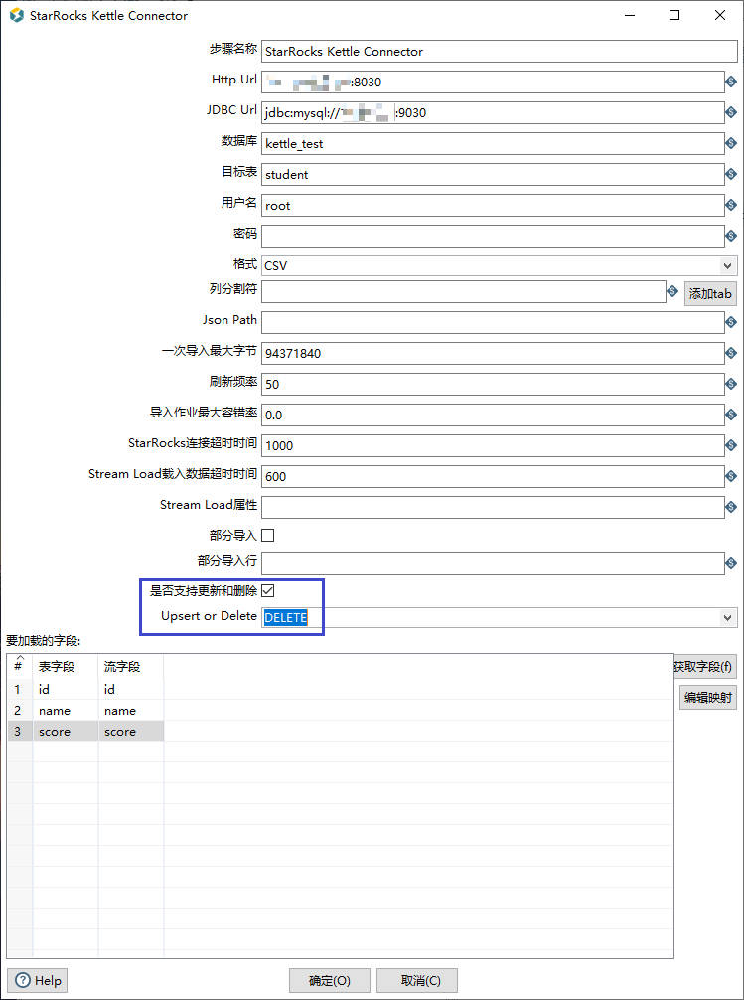

4. 查询数据

导入完成后，查询 `table2` 表的数据，如下所示：

~~~mysql
StarRocks > select * from student;
+------+-------+-------+
| id   | name  | score |
+------+-------+-------+
|    3 | Alice |    24 |
|    5 | Jeson |     0 |
|    1 | Lily  |    90 |
|    4 | Julia |    25 |
+------+-------+-------+
4 rows in set (0.00 sec)
~~~

从查询结果可以看到，`example2.csv`文件中`id`为`2`的数据已经从`student`表中删除。


#### 部分导入

自 StarRocks v2.2 起，主键模型表支持部分更新 (Partial Update)，您可以选择只更新部分指定的列。这里以 CSV 格式的数据文件为例进行说明。

1. 准备数据文件

在本地文件系统创建一个 CSV 格式的数据文件 `example3.csv`。文件包含两列，分别代表用户 ID 和用户姓名，如下所示：

~~~mysql
6,Rose
7,Appolo
~~~

2. 准备StarRocks表

使用上一步创建的数据库 `kettle_test` 中名为 `student` 的主键模型表。表包含 `id`、`name` 和 `score` 三列，分别代表用户 ID、用户名称和用户得分，主键为 `id` 列，其中数据如下所示：

~~~mysql
StarRocks > select * from student;
+------+-------+-------+
| id   | name  | score |
+------+-------+-------+
|    3 | Alice |    24 |
|    5 | Jeson |     0 |
|    1 | Lily  |    90 |
|    4 | Julia |    25 |
+------+-------+-------+
4 rows in set (0.00 sec)
~~~

3. 导入数据

通过导入，把 `example3.csv` 里的两列数据更新到 `student` 表的 `id` 和 `name` 两列。

需要勾选**部分导入**，其中**部分导入行**可填写也可为空。

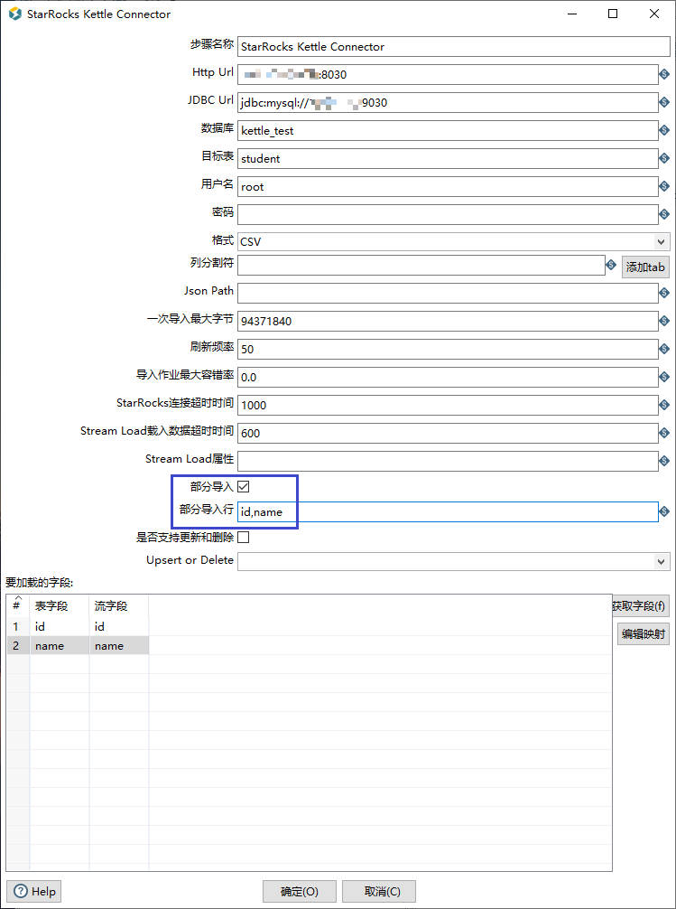

4. 查询数据

导入完成后，查询 `student` 表的数据，如下所示：

~~~mysql
StarRocks > select * from student;
+------+--------+-------+
| id   | name   | score |
+------+--------+-------+
|    1 | Lily   |    90 |
|    4 | Julia  |    25 |
|    7 | Appolo |     0 |
|    3 | Alice  |    24 |
|    5 | Jeson  |     0 |
|    6 | Rose   |     0 |
+------+--------+-------+
6 rows in set (0.00 sec)
~~~

从查询结果可以看到，`example3.csv` 文件中 `id` 为 `6`和`7` 的数据已经更新到 `student` 表中，并且 `example3.csv` 文件中 `id` 为 `6` 和 `7` 的数据已经插入到 `student` 表中。


### 各类型数据导入格式

1. 数据准备

在本地文件系统创建一个 CSV 格式的数据文件 `example4.csv`。如下所示：

~~~mysql
id,recruit_date,region_num,num_plate,tel,password,name,profile,hobby,leave_time,channel,income,account,ispass
1,2022-01-01,-50,-2500,-2000000000,12345678901234567890,John Doe,Software Engineer,Reading,2022-01-01 08:00:00,1.23,1234.5678,1000.1234,true
2,2022-01-02,-40,-2501,-2000000001,12345678901234567891,Jane Smith,Data Scientist,Writing,2022-01-02 09:00:00,2.34,2345.6789,1100.1234,false
3,2022-01-03,-30,-2502,-2000000002,12345678901234567892,Robert Brown,Web Developer,Cycling,2022-01-03 10:00:00,3.45,3456.7890,1200.1234,true
4,2022-01-04,-20,-2503,-2000000003,12345678901234567893,Emily Johnson,Database Admin,Swimming,2022-01-04 11:00:00,4.56,4567.8901,1300.1234,false
5,2022-01-05,-10,-2504,-2000000004,12345678901234567894,Michael Lee,Network Engineer,Hiking,2022-01-05 12:00:00,5.67,5678.9012,1400.1234,true
6,2022-01-06,0,-2505,-2000000005,12345678901234567895,Sarah Taylor,Security Analyst,Photography,2022-01-06 13:00:00,6.78,6789.0123,1500.1234,false
7,2022-01-07,10,-2506,-2000000006,12345678901234567896,William Davis,Systems Analyst,Dancing,2022-01-07 14:00:00,7.89,7890.1234,1600.1234,true
8,2022-01-08,20,-2507,-2000000007,12345678901234567897,Jessica Martinez,UX Designer,Painting,2022-01-08 15:00:00,8.90,8901.2345,1700.1234,false
9,2022-01-09,30,-2508,-2000000008,12345678901234567898,David Wilson,Product Manager,Music,2022-01-09 16:00:00,9.01,9012.3456,1800.1234,true
10,2022-01-10,40,-2509,-2000000009,12345678901234567899,Mary White,HR Specialist,Traveling,2022-01-10 17:00:00,10.12,1012.4567,1900.1234,false
~~~

2. StarRocks数据库建立

在数据库 `kettle_test` 中创建一张名为 `detailDemo` 的主键模型表。主键为 `id` 列，如下所示：

~~~mysql
use kettle_test;
CREATE TABLE IF NOT EXISTS `detailDemo` (
    `id`            BIGINT         COMMENT "range [-2^63 + 1 ~ 2^63 - 1]",
    `recruit_date`  DATE           NOT NULL COMMENT "YYYY-MM-DD",
    `region_num`    TINYINT        COMMENT "range [-128, 127]",
    `num_plate`     SMALLINT       COMMENT "range [-32768, 32767] ",
    `tel`           INT            COMMENT "range [-2147483648, 2147483647]",
    `password`      LARGEINT       COMMENT "range [-2^127 + 1 ~ 2^127 - 1]",
    `name`          CHAR(20)       NOT NULL COMMENT "range char(m),m in (1-255)",
    `profile`       VARCHAR(500)   NOT NULL COMMENT "upper limit value 1048576 bytes",
    `hobby`         STRING         NOT NULL COMMENT "upper limit value 65533 bytes",
    `leave_time`    DATETIME       COMMENT "YYYY-MM-DD HH:MM:SS",
    `channel`       FLOAT          COMMENT "4 bytes",
    `income`        DOUBLE         COMMENT "8 bytes",
    `account`       DECIMAL(12,4)  COMMENT "",
    `ispass`        BOOLEAN        COMMENT "true/false"
)ENGINE=OLAP
PRIMARY KEY(`id`)
DISTRIBUTED BY HASH(`id`);
~~~

3. 配置Kettle对应类型

根据上述数据类型对应表更改，导入数据的数据类型。

| id           | Integer   |
| ------------ | --------- |
| recruit_date | Date      |
| region_num   | Integer   |
| num_plate    | Integer   |
| tel          | Integer   |
| password     | BigNumber |
| name         | String    |
| profile      | String    |
| hobby        | String    |
| leave_time   | Timestamp |
| channel      | Number    |
| income       | Number    |
| account      | BigNumber |
| ispass       | Boolean   |

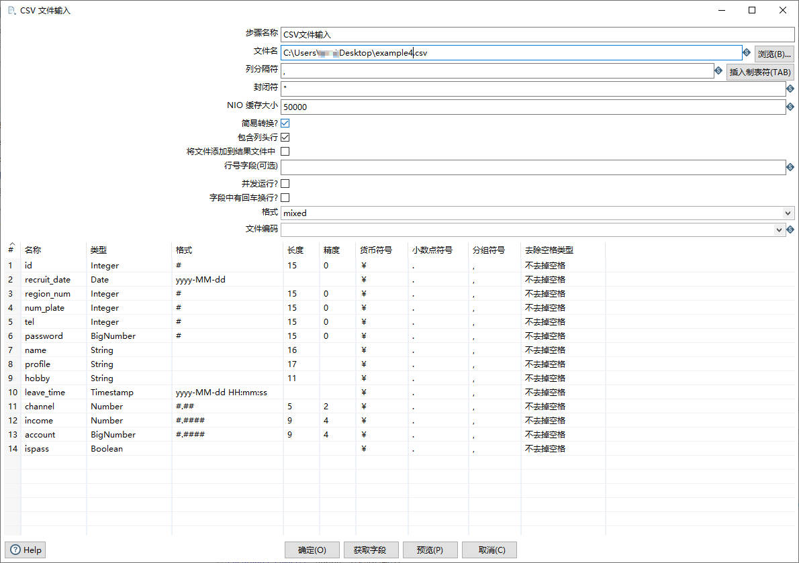

4. 导入数据

StarRocks参数设置同[导入CSV格式的数据](# 导入CSV格式的数据)配置相同。

导入完成后，查询 `detailDemo` 表的数据，如下所示：

~~~mysql
StarRocks > select * from detailDemo;
+------+--------------+------------+-----------+-------------+----------------------+------------------+-------------------+-------------+---------------------+---------+-----------+-----------+--------+
| id   | recruit_date | region_num | num_plate | tel         | password             | name             | profile           | hobby       | leave_time          | channel | income    | account   | ispass |
+------+--------------+------------+-----------+-------------+----------------------+------------------+-------------------+-------------+---------------------+---------+-----------+-----------+--------+
|    1 | 2022-01-01   |        -50 |     -2500 | -2000000000 | 12345678901234567890 | John Doe         | Software Engineer | Reading     | 2022-01-01 08:00:00 |    1.23 | 1234.5678 | 1000.1234 |      1 |
|    6 | 2022-01-06   |          0 |     -2505 | -2000000005 | 12345678901234567895 | Sarah Taylor     | Security Analyst  | Photography | 2022-01-06 13:00:00 |    6.78 | 6789.0123 | 1500.1234 |      0 |
|    8 | 2022-01-08   |         20 |     -2507 | -2000000007 | 12345678901234567897 | Jessica Martinez | UX Designer       | Painting    | 2022-01-08 15:00:00 |     8.9 | 8901.2345 | 1700.1234 |      0 |
|    7 | 2022-01-07   |         10 |     -2506 | -2000000006 | 12345678901234567896 | William Davis    | Systems Analyst   | Dancing     | 2022-01-07 14:00:00 |    7.89 | 7890.1234 | 1600.1234 |      1 |
|    9 | 2022-01-09   |         30 |     -2508 | -2000000008 | 12345678901234567898 | David Wilson     | Product Manager   | Music       | 2022-01-09 16:00:00 |    9.01 | 9012.3456 | 1800.1234 |      1 |
|   10 | 2022-01-10   |         40 |     -2509 | -2000000009 | 12345678901234567899 | Mary White       | HR Specialist     | Traveling   | 2022-01-10 17:00:00 |   10.12 | 1012.4567 | 1900.1234 |      0 |
|    4 | 2022-01-04   |        -20 |     -2503 | -2000000003 | 12345678901234567893 | Emily Johnson    | Database Admin    | Swimming    | 2022-01-04 11:00:00 |    4.56 | 4567.8901 | 1300.1234 |      0 |
|    2 | 2022-01-02   |        -40 |     -2501 | -2000000001 | 12345678901234567891 | Jane Smith       | Data Scientist    | Writing     | 2022-01-02 09:00:00 |    2.34 | 2345.6789 | 1100.1234 |      0 |
|    3 | 2022-01-03   |        -30 |     -2502 | -2000000002 | 12345678901234567892 | Robert Brown     | Web Developer     | Cycling     | 2022-01-03 10:00:00 |    3.45 |  3456.789 | 1200.1234 |      1 |
|    5 | 2022-01-05   |        -10 |     -2504 | -2000000004 | 12345678901234567894 | Michael Lee      | Network Engineer  | Hiking      | 2022-01-05 12:00:00 |    5.67 | 5678.9012 | 1400.1234 |      1 |
+------+--------------+------------+-----------+-------------+----------------------+------------------+-------------------+-------------+---------------------+---------+-----------+-----------+--------+
10 rows in set (0.01 sec)
~~~

### 错误日志

当导入数据出现错误时，`Kettle`控制台中只会输出错误信息，若想查看详细的日志记录可在`data-integration\logs\pdi.log`中查看。其中包括`Kettle`的运行信息和`StarRocks`的`Stream Load`相关的`DEBUGE`信息。

# Limitation

- 不支持`at-least-once`和`exactly-once`导入方式：Kettle中没有数据回滚和异常重试的机制，kettle在遇到导入错误时会直接停止数据的导入任务。
- 暂不支持列数据计算，只可通过在Kettle中增加相关步骤进行过滤转换。
- Kettle中暂不支持处理`HLL`和`Bitmap`位图这两种高级数据结构。

## 注意事项

- kttle版本尽量使用最近版本，9.3.0.0-349开始更新为Java11.
- 在kettle中现实的`FieldTable`名称应该和数据库的名称一样。
- 映射需要实现表字段和源字段的字段顺序正确，如果对应不对则保持源字段顺序不变，更改表字段顺序使其与源字段对应。
- JDBC地址只用于从`fe`节点中获取数据库表信息，只需添加一个地址即可。
- Kettle在进行Check时StarRocks中的`largeint`会被获取成`UNKNOW`，`boolean`会被映射成`tinyint`，这两处错误可忽略。
- 只支持`CSV`和`JSON`两种数据格式：在使用`Stream Load`向`StarRocks`导入数据时只采用这两种数据格式。导入步骤的上游源数据则可是Kettle中的任意数据格式。

## TODO

- 如果想要实现源数据中的一部分数据导入StarRocks中，需要在两步骤之间加入一个过滤步骤，将要部分导入的列行保留其余列过滤。
- 对于数据的更新插入和删除功能还没有实现分别的删除和更新插入，只能单独的删除或更新插入。或在传入数据的时候添加上op列对其进行操作。
- 实现Kettle自动创建StarRocks数据库表的功能。
- 将项目交到真实用户进行测试，根据测试反馈完善项目。
- 支持实现HLL和BITMAP类型的数据导入。